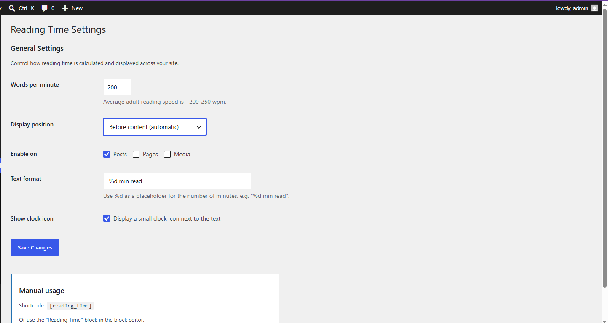

# Reading Time Plugin

A lightweight WordPress plugin that calculates and displays estimated reading
time on posts and pages — settings page, `[reading_time]` shortcode, and a
native Gutenberg block. No build tools, no dependencies, plain PHP/CSS/JS.



## Features

- Auto-inject before/after content, or manual-only mode
- Configurable WPM, text format, clock icon, per-post-type control
- `[reading_time]` shortcode (`[reading_time id="123" wpm="180"]`)
- Native Gutenberg block with live server-side-rendered preview
- Filters for developers: `rtp_word_count`, `rtp_reading_minutes`,
  `rtp_display_text`, `rtp_reading_time_html`, `rtp_should_display`


## Plugin structure

```
reading-time-plugin/
├── reading-time-plugin.php        # Bootstrap: header, constants, activation hooks
├── uninstall.php                  # Cleanup on delete (not on deactivate)
├── includes/
│   ├── class-rtp-calculator.php   # Pure word-count / minutes logic + filters
│   ├── class-rtp-admin.php        # Settings API page (Settings > Reading Time)
│   ├── class-rtp-shortcode.php    # [reading_time] shortcode
│   ├── class-rtp-content-filter.php  # Auto the_content injection
│   └── class-rtp-block.php        # Gutenberg block registration (PHP side)
├── blocks/reading-time/
│   ├── block.json                 # Block metadata (API v3)
│   └── index.js                   # Editor UI (plain JS, no JSX/webpack)
├── assets/css/
│   ├── reading-time.css           # Front-end badge styling
│   └── admin.css                  # Settings page styling
└── readme.txt                     # WordPress.org-format readme
```


## License

GPLv2 or later — required for anything distributed on WordPress.org, and
the conventional choice for WordPress plugins generally.
